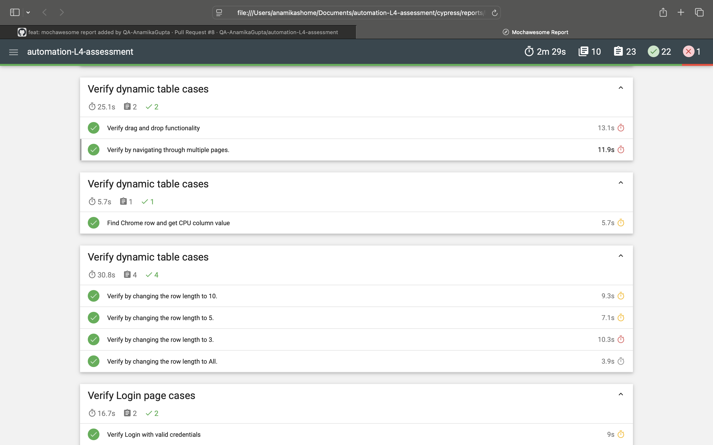

# 🧪 Automation Assessment — Expand Testing Practice Site


---

## 📍 Project Overview

This project automates both **UI** and **API** test scenarios for the web application hosted at  
👉 [https://practice.expandtesting.com](https://practice.expandtesting.com)

It demonstrates professional automation practices using **Cypress (JavaScript)**, including:

- 🧩 **Page Object Model (POM)** for maintainable test design  
- 🔄 **Dynamic data generation** with Faker  
- ⚙️ **Environment-configurable & data-driven tests**  
- 📊 **Mochawesome HTML reports** for clear insights  
- 🕵️ **Spies, Stubs & Clock** for advanced Cypress features  
- 🌐 **Full CRUD API automation** with schema validation  

---

## 🧰 Tech Stack & Tools

| Category | Tool / Library | Purpose |
|-----------|----------------|----------|
| **UI Automation** | Cypress | Web UI testing |
| **API Automation** | `cy.request()` | REST API testing |
| **Data Generation** | `@faker-js/faker` | Random, realistic test data |
| **Test Design Pattern** | Page Object Model (POM) | Scalability & readability |
| **Reporting** | Mochawesome | HTML + JSON test reports |
| **Schema Validation** | `chai-json-schema` | API response structure checks |
| **Version Control** | Git & GitHub | Collaboration & CI |

---

## 🏗️ Project Structure

<pre>
automation-L4-assessment/
├── cypress/
│   ├── e2e/                  # Test specs (UI & API)
│   ├── fixtures/             # Static data
|   |── pages/
|   |   |── pageObjects/      # POM classes
│   ├── support/
│   │   ├── commands.js       # Custom commands
│   │   ├── e2e.js            # Global setup
│   └── reports/              # Mochawesome reports
├── cypress.config.js         # Cypress configuration
├── package.json
├── README.md                 # Documentation
</pre>

---

## ⚙️ Setup Instructions

### 1. Clone the Repository
```bash
git clone https://github.com/QA-AnamikaGupta/automation-L4-assessment.git
cd automation-L4-assessment
```
---
## 2. Install dependencies
npm install

## 3. Add environment variables
@to-do
  "apiBaseUrl":  

## 4. Run tests locally

### UI tests (headed mode):
```bash
npx cypress open
```

### Headless mode (CI-friendly):
```bash
npx cypress run
```

## 📊 Test Reports (Mochawesome)
- After running the tests, Mochawesome generates detailed HTML reports.

### Default report path:
```bash
cypress/reports/mochawesome-report.html
```

### To open the report manually:
```bash
npx mochawesome-merge cypress/reports/mochawesome-report/*.json > cypress/reports/mochawesome-report/output.json
npx marge cypress/reports/mochawesome-report/output.json --reportDir cypress/reports/html --inline
open cypress/reports/html/output.html
```

## 🖼️ Sample Report Screenshot:


## 🧩 Scenarios Covered

| Scenario                            | Description                                                                       |
| ----------------------------------- | --------------------------------------------------------------------------------- |
| **Web Inputs**                      | Validate text, dropdowns, checkboxes, and radio buttons with valid & invalid data |
| **Login Page**                      | Positive and negative login, error validation                                     |
| **Register Page**                   | Dynamic registration flow using Faker-generated data                              |
| **Dynamic Table**                   | Extract CPU value for Chrome and validate with displayed label                    |
| **Dynamic Pagination Table**        | Paginate, validate row counts, and ensure consistency                             |
| **Drag and Drop**                   | Verify element position changes after drag/drop                                   |
| **Add/Remove Elements**             | Add multiple elements and validate correct removal                                |
| **Notification Message**            | Handle non-deterministic success/failure messages                                 |
| **Cypress Spies, Stubs, and Clock** | Demonstrate event spying, geolocation stubbing, and time control                  |

## ✅ API Automation

| Endpoint             | Description                                                        |
| -------------------- | ------------------------------------------------------------------ |
| **Create Note**      | Validate success response, schema, and error handling              |
| **Retrieve Note(s)** | Validate single & multiple note fetch                              |
| **Update Note**      | Automate field updates and assert changes                          |
| **Delete Note**      | Validate resource deletion & negative (non-existing note) scenario |

## 🧱 Design & Architecture
**POM (Page Object Model):**
- Each page action and locator is isolated in its own class under pageObjects/.
**Data-Driven Tests:**
- Uses Faker for generating random, unique data (usernames, note titles, etc.).
**Reusable Commands:**
- Common flows like login, token fetch, and note creation are abstracted in commands.js.
**Reporting:**
- Mochawesome provides easy-to-share HTML test summaries.

## 🧠 Challenges & Learnings
- Handling non-deterministic notification messages using retry and conditional assertions.
- Managing dynamic test data for registration and API CRUD flows.
- Designing reusable POM structure and command utilities for maintainability.
- Ensuring stable selectors across dynamic UI elements.
- Integrating Mochawesome and schema validation for professional-grade test outputs.

## 👩‍💻 Author
Anamika Gupta
QA Automation Engineer | JavaScript + Cypress | API + UI Testing
